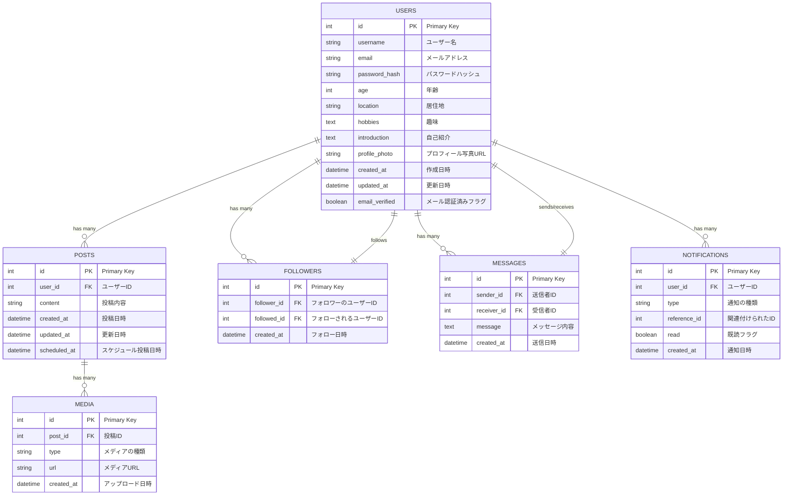

# social-newtworking
共通の興味、キャリア、背景、実生活のグループに基づいて、ユーザーがソーシャルネットワークを築けるような SNS ウェブアプリケーション 
この SNS アプリは、機能的には Twitter に似ており、非常に軽量です。ユーザーはプロフィールを作成し、短いメッセージを投稿し、メディアコンテンツを共有し、プライベートメッセージで他のユーザーと交流し、通知を確認し、フォローしている人やトレンドに基づくホームページのタイムラインを楽しむことができます。ウェブアプリには他にも、投稿に「いいね」する機能、投稿をスケジュールする機能、投稿に返信する機能、投稿を削除する機能がありますが、投稿を更新することはできません。ウェブアプリは、コミュニケーションと情報共有のための使いやすいプラットフォームを提供します。
## 要件モデリング
- [要件定義](https://github.com/KoshinHagimoto/social-newtworking/wiki/%E8%A6%81%E4%BB%B6%E5%AE%9A%E7%BE%A9)

## ソフトウェア設計
### ER図

### Usersテーブル

| Column Name | Type | Description |
| --- | --- | --- |
| id | INT AUTO_INCREMENT | Primary Key |
| username | VARCHAR(255) | ユーザー名 |
| email | VARCHAR(255) | メールアドレス |
| password_hash | VARCHAR(255) | パスワードのハッシュ |
| age | INT | 年齢 |
| location | VARCHAR(255) | 居住地 |
| hobbies | TEXT | 趣味 |
| introduction | TEXT | 自己紹介 |
| profile_photo | VARCHAR(255) | プロフィール写真URL |
| created_at | DATETIME | 作成日時 |
| updated_at | DATETIME | 更新日時 |
| email_verified | BOOLEAN | メール認証済みフラグ |

### postsテーブル
ユーザーの投稿を格納

| Column Name | Type | Description |
| --- | --- | --- |
| id | INT AUTO_INCREMENT | Primary Key |
| user_id | INT | ユーザーID |
| content | VARCHAR(255) | 投稿内容 |
| created_at | DATETIME | 投稿日時 |
| updated_at | DATETIME | 更新日時 |
| scheduled_at | DATETIME | スケジュール投稿日時 |

### followersテーブル

| Column Name | Type | Description |
| --- | --- | --- |
| id | INT AUTO_INCREMENT | Primary Key |
| follower_id | INT | フォローするユーザーID |
| followed_id | INT | フォローされるユーザーID |
| created_at | DATETIME | フォロー日時 |

### **messages テーブル**

プライベートメッセージを格納します。

| Column Name | Type | Description |
| --- | --- | --- |
| id | INT AUTO_INCREMENT | Primary Key |
| sender_id | INT | 送信者ID |
| receiver_id | INT | 受信者ID |
| message | TEXT | 暗号化されたメッセージ |
| created_at | DATETIME | 送信日時 |

### **notifications テーブル**

通知を格納します。

| Column Name | Type | Description |
| --- | --- | --- |
| id | INT AUTO_INCREMENT | Primary Key |
| user_id | INT | ユーザーID |
| type | VARCHAR(50) | 通知の種類 |
| reference_id | INT | 関連付けられたID |
| read | BOOLEAN | 既読フラグ |
| created_at | DATETIME | 通知日時 |

### **media テーブル**

投稿に添付されたメディアファイルを格納します。

| Column Name | Type | Description |
| --- | --- | --- |
| id | INT AUTO_INCREMENT | Primary Key |
| post_id | INT | 投稿ID |
| type | VARCHAR(50) | メディアの種類 |
| url | VARCHAR(255) | メディアファイルのURL |
| created_at | DATETIME | アップロード日時 |

## API設計

### **ユーザー関連**

| エンドポイント | メソッド | 説明 | リクエストボディ | レスポンス |
| --- | --- | --- | --- | --- |
| /users | POST | 新規ユーザーを作成 | ユーザー情報 (名前、メール等) | 作成されたユーザー情報 |
| /users/{userID} | GET | 特定のユーザーのプロフィール取得 | なし | ユーザーのプロフィール情報 |
| /users/{userID}/profile_photo | POST | プロフィール写真をアップロード | 写真データ | アップロード結果 |
| /users/{userID}/follow | POST | ユーザーをフォロー | なし | フォロー結果 |
| /users/{userID}/unfollow | POST | ユーザーのフォローを解除 | なし | アンフォロー結果 |
| /users/{userID}/following | GET | 特定のユーザーがフォローしているユーザー一覧を取得 | なし | フォローしているユーザー一覧 |
| /users/{userID}/followers | GET | 特定のユーザーのフォロワー一覧を取得 | なし | フォロワー一覧 |

### **投稿関連**

| エンドポイント | メソッド | 説明 | リクエストボディ | レスポンス |
| --- | --- | --- | --- | --- |
| /posts | POST | 新しい投稿を作成 | 投稿内容 | 作成された投稿情報 |
| /posts/{postID} | DELETE | 投稿を削除 | なし | 削除結果 |
| /posts/{postID}/like | POST | 投稿に「いいね」を付ける | なし | 「いいね」結果 |
| /posts/{postID}/like | DELETE | 「いいね」を取り消す | なし | 取り消し結果 |
| /posts/{postID}/schedule | POST | 投稿のスケジュールを設定 | スケジュール情報 | スケジュール設定結果 |
| /posts/{postID}/media | POST | メディアコンテンツをアップロード | メディアデータ | アップロード結果 |

### **プライベートメッセージング**

| エンドポイント | メソッド | 説明 | リクエストボディ | レスポンス |
| --- | --- | --- | --- | --- |
| /messages | POST | プライベートメッセージを送信 | メッセージ内容 | 送信結果 |
| /messages/{messageID} | GET | 特定のメッセージを取得 | なし | メッセージ内容 |

### **通知**

| エンドポイント | メソッド | 説明 | リクエストボディ | レスポンス |
| --- | --- | --- | --- | --- |
| /notifications | GET | ユーザーの通知を取得 | なし | 通知一覧 |
| /notifications/{notificationID}/read | POST | 通知を既読にする | なし | 既読結果 |

### **タイムライン**

| エンドポイント | メソッド | 説明 | リクエストボディ | レスポンス |
| --- | --- | --- | --- | --- |
| /timeline/home | GET | ホームページのタイムラインを取得 | なし | 投稿一覧 |
| /timeline/trends | GET | トレンドのタイムラインを取得 | なし | 投稿一覧 |
| /timeline/followers | GET | フォロワーからの投稿を含むタイムラインを取得 | なし | 投稿一覧 |
